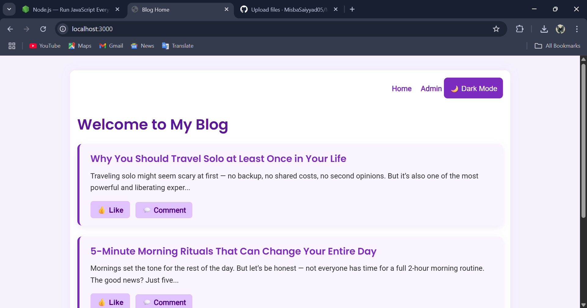
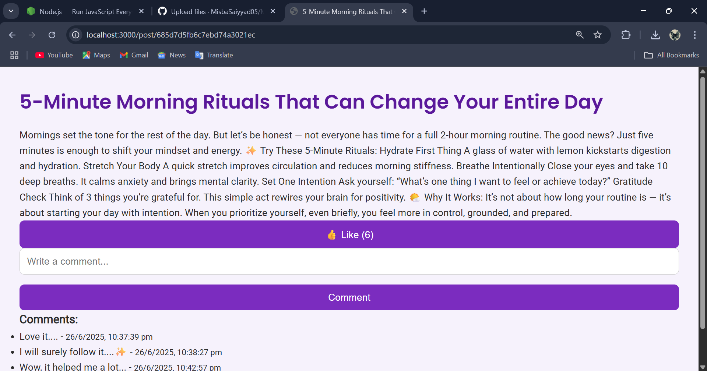

# Blog Website

A full-stack blog website built using **Node.js**, **Express**, **MongoDB**, and **EJS**. It allows an admin to create blog posts, and users to like and comment on each post. The website features a responsive purple-themed design with a dark mode toggle for enhanced user experience.

---

## Features

- Admin login to create blog posts
- Like button with real-time count tracking
- Comment section for user interaction
- Dark Mode toggle with local storage support
- Responsive, modern purple/light-themed UI

---

## Tech Stack

- **Frontend**: EJS, CSS, JavaScript
- **Backend**: Node.js, Express
- **Database**: MongoDB + Mongoose

---

## Getting Started

1. Clone the repository
    ```bash
        git clone https://github.com/your-username/blog-website.git
        cd blog-website
        exit
    
2. Install dependencies
   ```bash
         npm install
         exit
   
3. Start MongoDB
If installed as a service (recommended), it starts automatically. Otherwise, open a terminal and run:
   ```bash
         mongod
         exit
   
4. Run the app
   ```bash
         node app.js
         exit

5. Open in browser
   ```bash
         http://localhost:3000
         exit

##  Admin Login

Username: admin
Password: admin123

## Project Structure
├── models
│   └── Post.js
├── public
│   ├── css
│   │   └── style.css
│   └── js
│       └── script.js
├── routes
│   └── blogRoutes.js
├── views
│   ├── index.ejs
│   ├── post.ejs
│   ├── dashboard.ejs
│   └── login.ejs
├── app.js
└── package.json

## Screenshots




## Author
Developed By Misba Saiyyad


   


